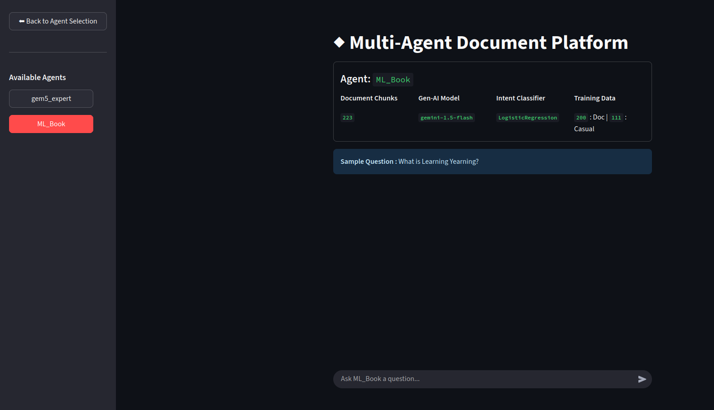

# Multi-Agent Document Platform

A Streamlit application that allows users to chat with pre-built document agents or create their own custom agents by simply uploading a PDF file. Each agent is equipped with a trained intent classifier in real-time to handle queries efficiently using a Retrieval-Augmented Generation (RAG) pipeline.

---

## Key Features

-   **Multi-Agent Architecture:** Start with pre-built agents (e.g., "gem5 Expert") and dynamically create new, custom agents for any PDF document.

-   **Real-time Agent Creation:** Uploading a PDF automatically triggers a full machine learning pipeline that chunks the document, creates a vector database, synthetically generates a training dataset, and trains a unique intent classifier for that agent.

-   **Dynamic Intent Classification:** Each custom agent uses its own `LogisticRegression` classifier to distinguish between casual conversation and document-specific questions (`doc_qna`), ensuring resources are used efficiently.

-   **RAG Pipeline:** Leverages `SentenceTransformer` embeddings and a persistent `ChromaDB` vector store to retrieve the most relevant context from a document before passing it to the language model.

-   **Source Attribution:** Responses for custom agents include the source page numbers, enhancing trust and verifiability.

---

## Application Workflow

### 1. Agent Creation

When a user uploads a new PDF, a 5-step process (visible via status toasts in the UI) creates a fully functional agent:

1.  **Chunking:** The PDF is parsed, and its text is split into manageable chunks. A new `ChromaDB` collection is created to store the embeddings for these chunks.
2.  **Data Generation:** Keywords are extracted from the text chunks using `YAKE`. These keywords are used to synthetically generate a list of relevant, document-specific questions, which will form the `doc_qna` portion of our training set.
3.  **Dataset Assembly:** The generated `doc_qna` questions are combined with a predefined list of `casual` questions from `casual_queries.csv` to form a training dataset.
4.  **Embedding Generation:** All training queries are converted into numerical vector embeddings using the `SentenceTransformer` model.
5.  **Classifier Training:** A `LogisticRegression` model is trained on the embeddings. The final trained classifier and its corresponding `LabelEncoder` are saved as `.joblib` files, ready for use.


### 2. Chatting with an Agent

1.  **Intent Classification:** The user's query is first converted into an embedding and passed to the agent's unique, trained `LogisticRegression` model. The model classifies the intent as either `doc_qna` or `casual`.
2.  **Conditional Routing:**
    -   **If `casual`**, the RAG pipeline is skipped, and a polite, pre-defined response is given.
    -   **If `doc_qna`**, the RAG pipeline is triggered.
3.  **Retrieval (RAG):** The query embedding is used to search the agent's `ChromaDB` collection, retrieving the top 5 most relevant text chunks from the source document.
4.  **Generation (RAG):** The retrieved chunks are formatted into a detailed prompt along with the original query. This is sent to the `gemini-1.5-flash` LLM, which generates an answer based strictly on the provided context.
5.  **Display:** The final response, including source citations, is displayed in the chat interface.



---

## Tech Stack

-   **Frontend:** Streamlit
-   **Intent Classifier:** Scikit-learn (`LogisticRegression`)
-   **Embedding Model:** `sentence-transformers/all-MiniLM-L6-v2`
-   **LLM:** Google Gemini 1.5 Flash (`gemini-1.5-flash`)
-   **Vector Database:** `ChromaDB`
-   **Keyword Extraction:** `YAKE`

---

## Setup and Local Installation

To run this application on your local machine, follow these steps.

1.  **Clone the Repository**
    ```bash
    git clone https://github.com/Anand-786/multi-doc-agent.git
    cd multi-doc-agent
    ```

2.  **Create and Activate a Virtual Environment**
    ```bash
    python -m venv venv
    source venv/bin/activate  # On Windows, use `venv\Scripts\activate`
    ```

3.  **Install Dependencies**
    ```bash
    pip install -r requirements.txt
    ```

4.  **Set Up Environment Variables**
    Create a file named `.env` in the project's root directory and add your Google API key:
    ```
    GOOGLE_API_KEY="your_api_key_here"
    ```

5.  **Create the Casual Queries File**
    Create a file named `casual_queries.csv` in the root directory with the entries like this:
    ```csv
    query,intent
    "Hello there!",casual
    "Hey, how are you?",casual
    "What's up?",casual
    "Thank you!",casual
    "Thanks a lot",casual
    "bye",casual
    ```

6.  **Run the Application**
    ```bash
    streamlit run src/app_multi_agent.py
    ```